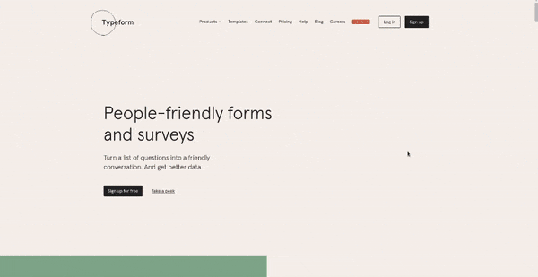
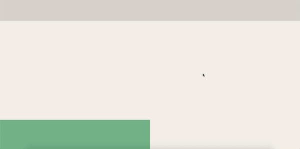

<p align="center">
   
</p>

<p align="center">	
  <a href="https://www.linkedin.com/in/marco-echevestre/">
      
  </a>
  
  
  <a href="https://github.com/marcoaminotto/ui-clone-typeform-homepage/commits/master">
    
  </a> 
  
  
</p>

> :book: [Typeform](https://www.typeform.com/) is a survey software application that helps you create online surveys that are unique and memorable. This project is a UI clone of the homepage animation of Typeform.

# 📐 Layout

## Original

<div align="center">
  
</div>

## Clone

<div align="center">
  
</div>

# :rocket: Technologies

This project was made using the following technologies:

- [Typescript](https://www.typescriptlang.org/)
- [React](https://reactjs.org/)
- [Styled-components](https://styled-components.com/)
- [Framer Motion](https://www.framer.com/motion/)

# 🔧 How to run

```bash
# Clone Repository
$ git clone git@github.com:marcoaminotto/ui-clone-typeform-homepage.git
```

### 💻 Run web application

```bash
# Go to web folder
$ cd ui-clone-typeform-homepage/web

# Install Dependencies
$ yarn install

# Run Aplication
$ yarn start
```

Go to http://localhost:3000/ to see the nice animation.

# :closed_book: License

Released in 2020 :closed_book: License

This project is under the [MIT license](./LICENSE).

Give a ⭐️ if this project helped you!

#

<p align="center">
   <b> &#60;/&#62; by <a href="https://www.linkedin.com/in/marco-echevestre/">Marco Echevestre</a></b>
</p>
